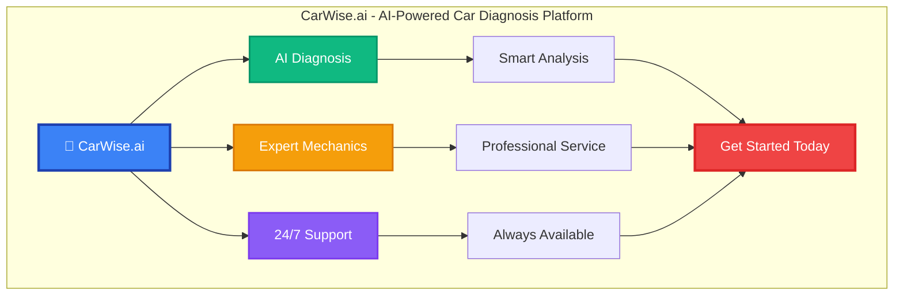

# CarWise.ai Hero Banner Design

## Facebook/LinkedIn Banner (1200x630px)

## Key Features Highlight
- 🔍 **AI-Powered Diagnosis**: Get instant, accurate car problem analysis
- 🔧 **Expert Mechanics**: Connect with verified professionals
- 📱 **Mobile App**: Access anywhere, anytime
- 🌍 **Multi-language**: Available in multiple languages
- 💰 **Transparent Pricing**: No hidden costs
- ⭐ **5-Star Reviews**: Trusted by thousands of users

## Call-to-Action
**"Start Your Free Diagnosis Today!"**

