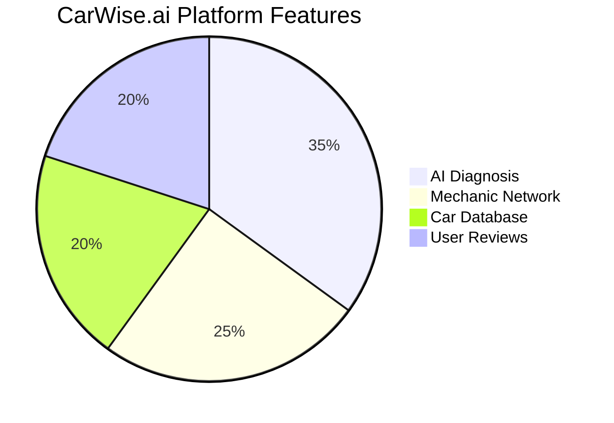
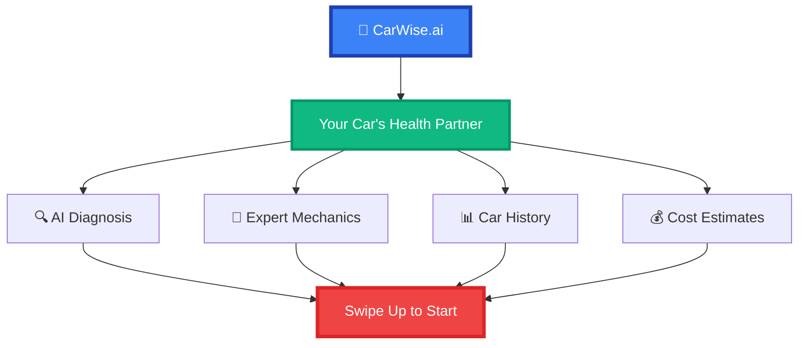

# CarWise.ai Instagram Post Design

## Instagram Feed Post (1080x1080px)



## Instagram Story Design (1080x1920px)



## Caption Ideas

### Post 1: AI Diagnosis
```
🚗✨ Transform your car care experience with CarWise.ai!

Our AI-powered diagnosis system provides:
✅ Instant problem detection
✅ Detailed repair recommendations  
✅ Cost estimates
✅ Expert mechanic connections

No more guessing what's wrong with your car! 

#CarWiseAI #CarDiagnosis #AITechnology #CarMaintenance #SmartCars #AutomotiveTech #CarCare #MechanicApp
```

### Post 2: Mechanic Network
```
🔧 Connect with the best mechanics in your area!

CarWise.ai features:
⭐ Verified professionals
⭐ Real customer reviews
⭐ Transparent pricing
⭐ 24/7 availability

Find your perfect mechanic match today! 

#CarWiseAI #MechanicNetwork #CarRepair #ProfessionalService #CarMaintenance #TrustedMechanics #CarCare
```

### Post 3: Success Story
```
🎉 Success Story: Sarah saved $500 on her car repair!

"CarWise.ai helped me understand exactly what was wrong with my car and connected me with an honest mechanic who fixed it for half the original quote!"

Join thousands of satisfied customers! 

#CarWiseAI #SuccessStory #CarRepair #CustomerSatisfaction #MoneySaving #HonestMechanics #CarCare
```


