# CarWise.ai LinkedIn Banner Design

## LinkedIn Company Page Banner (1584x396px)

```mermaid
graph TB
    subgraph "CarWise.ai - Transforming Automotive Care with AI Technology"
        A["🚗 CarWise.ai"] --> B["AI-Powered Diagnosis"]
        A --> C["Professional Network"]
        A --> D["Smart Solutions"]
        
        B --> E["Instant Analysis"]
        C --> F["Verified Mechanics"]
        D --> G["Cost Optimization"]
        
        E --> H["Join the Future of Car Care"]
        F --> H
        G --> H
    end
    
    style A fill:#3b82f6,stroke:#1e40af,stroke-width:4px,color:#fff
    style B fill:#10b981,stroke:#059669,stroke-width:3px,color:#fff
    style C fill:#f59e0b,stroke:#d97706,stroke-width:3px,color:#fff
    style D fill:#8b5cf6,stroke:#7c3aed,stroke-width:3px,color:#fff
    style H fill:#ef4444,stroke:#dc2626,stroke-width:4px,color:#fff
```



## LinkedIn Company Description

### Short Description
```
AI-powered car diagnosis platform connecting vehicle owners with expert mechanics. Smart, transparent, and reliable automotive care solutions.
```

### Long Description
```
CarWise.ai is revolutionizing the automotive care industry through cutting-edge AI technology and a comprehensive network of verified mechanics.

Our platform provides:
🔍 Instant AI-powered car diagnosis
🔧 Access to verified professional mechanics
📊 Transparent pricing and cost estimates
📱 Mobile-first user experience
🌍 Multi-language support
⭐ 5-star customer satisfaction

We're on a mission to eliminate the stress and uncertainty of car maintenance by providing accurate, instant diagnosis and connecting users with trusted professionals.

Join thousands of satisfied customers who have transformed their car care experience with CarWise.ai.

Visit us at: carwise.ai
```

## LinkedIn Post Ideas

### Post 1: Industry Insight
```
🚗 The automotive industry is evolving, and so should car care!

Traditional car diagnosis often leads to:
❌ Misdiagnosis (45% of cases)
❌ Overcharging (73% of repairs)
❌ Time waste (average 2-3 visits)

CarWise.ai is changing this with:
✅ AI-powered instant diagnosis
✅ Transparent pricing
✅ Verified mechanic network
✅ One-visit solutions

The future of car care is here. Are you ready?

#CarWiseAI #AutomotiveTech #Innovation #CarCare #AITechnology
```

### Post 2: Company Milestone
```
🎉 Exciting milestone: CarWise.ai has helped over 10,000 car owners!

Our AI diagnosis system has:
📊 Analyzed 25,000+ car problems
💰 Saved users $2.5M+ in repair costs
⭐ Maintained 4.8/5 customer rating
🔧 Connected users with 500+ verified mechanics

Thank you to our amazing community for trusting us with your car care needs!

#CarWiseAI #Milestone #CustomerSuccess #AutomotiveInnovation
```

### Post 3: Technology Focus
```
🤖 How AI is transforming car diagnosis:

Traditional approach:
1. Take car to mechanic
2. Wait for inspection
3. Get estimate
4. Schedule repair
5. Return for service

CarWise.ai approach:
1. Upload photo/describe issue
2. Get instant AI diagnosis
3. Receive cost estimate
4. Connect with verified mechanic
5. One-visit solution

Technology that saves time, money, and stress!

#CarWiseAI #AITechnology #AutomotiveInnovation #DigitalTransformation
```

### Post 4: Partnership Announcement
```
🤝 Exciting partnership announcement!

CarWise.ai is proud to partner with [Partner Name] to bring even better car care solutions to our users.

This collaboration will:
✅ Expand our mechanic network
✅ Improve diagnosis accuracy
✅ Enhance user experience
✅ Reduce service costs

Together, we're building the future of automotive care!

#CarWiseAI #Partnership #AutomotiveIndustry #Innovation
```

### Post 5: Team Spotlight
```
👥 Meet the CarWise.ai team!

Our diverse team of engineers, automotive experts, and customer success specialists work tirelessly to bring you the best car care experience.

From AI development to mechanic verification, every team member plays a crucial role in our mission to revolutionize automotive care.

We're hiring! Join our mission: careers@carwise.ai

#CarWiseAI #TeamSpotlight #Hiring #AutomotiveTech #CompanyCulture
```


