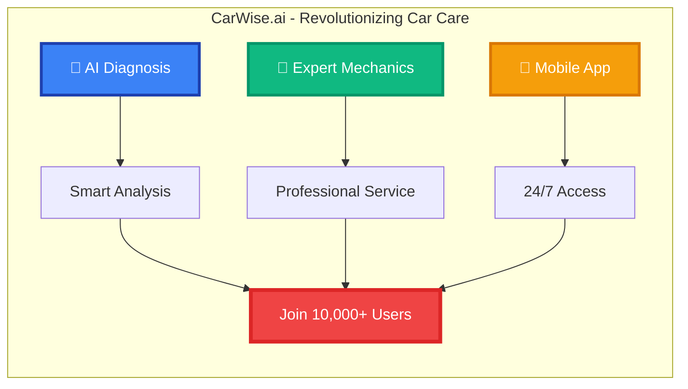

# CarWise.ai Twitter Header Design

## Twitter Profile Header (1500x500px)



## Twitter Bio Ideas

### Option 1: Professional
```
🚗 AI-powered car diagnosis platform
🔧 Connect with expert mechanics
📱 Available on web & mobile
🌍 Multi-language support
💡 Smart car maintenance made simple

#CarWiseAI #CarDiagnosis #AutomotiveTech
```

### Option 2: Conversational
```
Hey car owners! 👋
We're making car problems less stressful with AI diagnosis & expert mechanics. 
No more guessing what's wrong! 
Try us free: carwise.ai

#CarWiseAI #CarCare #NoMoreCarStress
```

### Option 3: Feature-focused
```
🔍 Instant car diagnosis
🔧 Verified mechanics
💰 Transparent pricing
⭐ 5-star reviews
📱 Download our app

Making car care smart & simple!

#CarWiseAI #SmartCars #CarMaintenance
```

## Tweet Ideas

### Tweet 1: Problem/Solution
```
🚨 Car making weird noises? 
Don't panic! 

CarWise.ai can diagnose the problem in seconds and connect you with expert mechanics in your area.

Try our free diagnosis: carwise.ai

#CarWiseAI #CarProblems #CarDiagnosis
```

### Tweet 2: Statistics
```
📊 Did you know?
- 73% of car owners overpay for repairs
- 45% of car problems are misdiagnosed
- Average repair cost: $500-1500

CarWise.ai helps you avoid both! 

#CarWiseAI #CarFacts #SaveMoney
```

### Tweet 3: User Testimonial
```
"CarWise.ai saved me $300 on my last repair! The AI diagnosis was spot-on and the mechanic they connected me with was honest and professional." - Sarah M.

Join thousands of satisfied customers! 

#CarWiseAI #CustomerReview #HonestMechanics
```

### Tweet 4: Educational
```
💡 Car Maintenance Tip:
Check your car's fluids monthly:
- Engine oil
- Coolant
- Brake fluid
- Power steering fluid

Need help? CarWise.ai can guide you through any car issue!

#CarWiseAI #CarMaintenance #CarTips
```

### Tweet 5: Seasonal
```
❄️ Winter is coming! 
Is your car ready?

CarWise.ai can help you:
✅ Check your battery
✅ Inspect your tires
✅ Test your heating system
✅ Prepare for cold weather

Get your winter car check: carwise.ai

#CarWiseAI #WinterPrep #CarSafety
```


