# CarWise.ai YouTube Thumbnail Design

## YouTube Video Thumbnail (1280x720px)

```mermaid
graph TB
    subgraph "CarWise.ai Tutorial Thumbnail"
        A["🚗 CarWise.ai"] --> B["How to Use AI Car Diagnosis"]
        B --> C["Step-by-Step Tutorial"]
        C --> D["FREE Diagnosis"]
        
        E["🔍 AI Analysis"] --> F["Expert Mechanics"]
        F --> G["Save Money"]
        
        D --> H["WATCH NOW"]
        G --> H
    end
    
    style A fill:#3b82f6,stroke:#1e40af,stroke-width:4px,color:#fff
    style B fill:#10b981,stroke:#059669,stroke-width:3px,color:#fff
    style C fill:#f59e0b,stroke:#d97706,stroke-width:3px,color:#fff
    style H fill:#ef4444,stroke:#dc2626,stroke-width:5px,color:#fff
```



## YouTube Channel Art (2560x1440px)

```mermaid
graph LR
    subgraph "CarWise.ai Channel Art"
        A["🚗 CarWise.ai"] --> B["AI-Powered Car Diagnosis"]
        B --> C["Expert Mechanics"]
        C --> D["24/7 Support"]
        
        E["Subscribe"] --> F["For More Car Tips"]
        F --> G["Hit the Bell"]
    end
    
    style A fill:#3b82f6,stroke:#1e40af,stroke-width:4px,color:#fff
    style B fill:#10b981,stroke:#059669,stroke-width:3px,color:#fff
    style C fill:#f59e0b,stroke:#d97706,stroke-width:3px,color:#fff
    style D fill:#8b5cf6,stroke:#7c3aed,stroke-width:3px,color:#fff
    style E fill:#ef4444,stroke:#dc2626,stroke-width:4px,color:#fff
```



## Video Ideas & Thumbnails

### Video 1: "How to Use CarWise.ai - Complete Tutorial"
**Thumbnail Elements:**
- CarWise.ai logo (large, top-left)
- "HOW TO USE" text (bold, yellow)
- Phone showing app interface
- "FREE DIAGNOSIS" badge (red, bottom-right)
- Arrow pointing to "START HERE"

### Video 2: "5 Common Car Problems & How to Fix Them"
**Thumbnail Elements:**
- Car with warning lights
- "5 COMMON PROBLEMS" text (bold, white)
- Wrench and tools
- "EASY FIXES" badge (green)
- CarWise.ai logo (small, bottom-left)

### Video 3: "Save $500 on Car Repairs with These Tips"
**Thumbnail Elements:**
- Money/dollar signs
- "SAVE $500" text (huge, green)
- Car in background
- "PROVEN TIPS" badge (blue)
- CarWise.ai logo

### Video 4: "AI vs Human Mechanic - Who's Better?"
**Thumbnail Elements:**
- Split screen: AI robot vs mechanic
- "AI vs HUMAN" text (bold, contrasting colors)
- Question mark in center
- "SHOCKING RESULTS" badge (red)
- CarWise.ai logo

### Video 5: "CarWise.ai Success Stories"
**Thumbnail Elements:**
- Happy customer with car
- "SUCCESS STORIES" text (bold, white)
- Star ratings
- "REAL RESULTS" badge (gold)
- CarWise.ai logo

## Video Descriptions

### Video 1: Tutorial
```
🚗 Learn how to use CarWise.ai for instant car diagnosis!

In this step-by-step tutorial, we'll show you:
✅ How to create an account
✅ How to submit a diagnosis request
✅ How to interpret AI results
✅ How to connect with mechanics
✅ How to track your repair progress

CarWise.ai makes car care simple, transparent, and affordable. Get your free diagnosis today!

🔗 Try CarWise.ai: carwise.ai
📱 Download our app: [App Store/Google Play links]

#CarWiseAI #CarDiagnosis #Tutorial #CarCare #AITechnology

Timestamps:
0:00 - Introduction
1:30 - Creating Account
3:15 - Submitting Diagnosis
5:45 - Understanding Results
7:20 - Connecting with Mechanics
9:10 - Tracking Progress
10:30 - Conclusion
```

### Video 2: Common Problems
```
🔧 Don't let these 5 common car problems cost you money!

In this video, we cover:
1. Check Engine Light (0:45)
2. Strange Noises (2:15)
3. Poor Fuel Economy (3:30)
4. Brake Issues (4:50)
5. Overheating (6:10)

Each problem includes:
✅ What it means
✅ Why it happens
✅ How to diagnose
✅ Cost estimates
✅ Prevention tips

CarWise.ai can help diagnose any of these issues instantly!

🔗 Get free diagnosis: carwise.ai

#CarWiseAI #CarProblems #CarMaintenance #CarTips #CarDiagnosis
```

### Video 3: Money Saving Tips
```
💰 Save hundreds on car repairs with these proven strategies!

Learn how to:
✅ Avoid unnecessary repairs
✅ Get accurate cost estimates
✅ Find honest mechanics
✅ Negotiate better prices
✅ Prevent future problems

Real examples of customers who saved $200-$800 using CarWise.ai!

🔗 Start saving: carwise.ai

#CarWiseAI #SaveMoney #CarRepair #CarTips #MoneySaving
```

## YouTube SEO Keywords

### Primary Keywords
- car diagnosis
- car repair
- car maintenance
- AI car diagnosis
- car problems
- mechanic finder
- car care app

### Long-tail Keywords
- how to diagnose car problems
- AI powered car diagnosis
- find honest mechanic
- car repair cost estimator
- mobile car diagnosis app
- instant car problem detection

### Tags
```
CarWiseAI, car diagnosis, car repair, car maintenance, AI technology, automotive, car problems, mechanic finder, car care, mobile app, car tips, save money, car troubleshooting, automotive technology, car health, vehicle diagnosis, smart car care, car service, automotive innovation, car solutions
```


